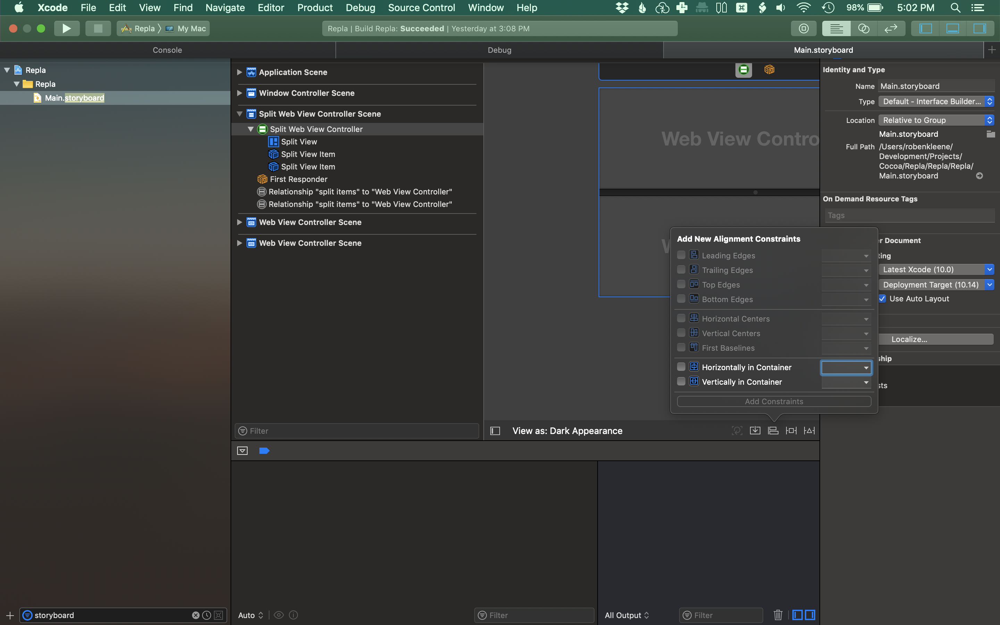
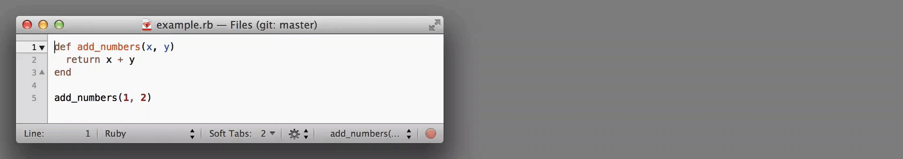

# Repla: A New-Old Programming Tool

How to make new innovating programming tools that work with existing tools and workflows.

Roben Kleene
[@robenkleene](https://twitter.com/robenkleene)
[robenkleene.com](https://robenkleene.com)
[github.com/robenkleene/repla-live-coding](https://github.com/robenkleene/repla-live-coding)

---

# Who Am I

* Developer for Apple platforms (iOS & Mac)
* Currently making a programming tool called Repla
* Left job managing WSJ iOS app team to make it
* I like AppKit GUI apps, and Unix TUI apps
* Not a researcher, trying to create a business

---

---

# Traits of Successful Programming Tools (For Existing Programmers) 1/2

- **Browser UI**: A lingua franca for graphics.
- **Language Agnostic**: Work with existing programming languages.
- **Plain Text**: An open data format.
- **Packages Written in Scripting Languages**: Make customizations easy to share and modify.

---

# Traits of Successful Programming Tools (For Existing Programmers) 2/2

- **Text Editors**: The concentration of programming man-hours.
- **Unix Processes**: Use child processes to extend capabilities.
- **Version Control**: State of the art collaboration.

---

# What do people give up to use your tool?

- Text editors?
- Version control?

Is your solution more useful?

---

# Case Study: Visual Studio Code
4;67;17M67;17M
Visual Studio Code is a **language agnostic** **plain text editor** used to edit files that can be stored in **version control**. It's user interface is displayed using a **browser rendering engine**. It's **packages are written in scripting languages** that run **Unix processes**.

Competes with text editors: [20-25 employees](https://changelog.com/podcast/277).

---

# Visual Studio Code Market Share

- **2016:** 7.2%
- **2017:** 22.3%
- **2018:** 34.9%
- **2019:** 50.7%

[Stack Overflow Insights](https://insights.stackoverflow.com/).

---

# Why Not Integrate With an IDE?

---

---

# When to integrate with an IDE?

If your feature fits into existing user interface features and requires no interaction.

- 👍 Linters
- 👎 Splits & Folds

---

# Repla

---

# What is Repla?

- A web rendering engine
- Unix process management
- A packaging system

# What isn't it?

- An editor
- It works alongside existing tools.

---

# Replaces something for some tasks... the browser

- Divided between two worlds, development when working on the application, and research. The latter is generally what browsers are designed for.
- Developers work with an editor, a terminal, and a browser. Repla replaces the browser for some tasks.
- Not as crazy as it sounds, an editor and a terminal both work the same way: extended with a packaging system, and run child processes.
- Repla aims to give the browser these same capabilities.

---

# Screenshots

---

---

---

---

---

## Use Cases & Roadmap

1. **Processes:** Web Development (integrate the server and browser into one window, automatically refresh)
2. **Packaging System:** Distributing Web Apps (one click install, one click run, e.g., Jupyter Notebooks)
3. **Packages 1:** Live Coding View
4. **Packages 2:** Framer Classic & Processing

---

# Inspiration (No Bret Victor or Light Table)

---

---

# Marked

- 👍 Plain text
- 👍 Works with text editors
- 👍 Works with version control
- 👎 Not language agnostic

---

---

# Soulver (Calca)

- 👎 Not plain text
- 👎 Not language agnostic
- 👎 Doesn't work with text editors
- 👎 Doesn't work with version control

---

---

# Observable (Jupyter Notebooks, Swift Playgrounds)

- 👎 Not plain text
- 👎 Not language agnostic
- 👎 Doesn't work with text editors
- 👎 Doesn't work with version control

---

---

# Framer Classic (Processing)

- 👎 Not plain text
- 👎 Not language agnostic
- 👎 Doesn't work with text editors
- 👎 Doesn't work with version control

---

# Live Coding With Repla

---

Packages for each language:

- `IRB.replaplugin`, `Python.replaplugin`, `Node.replaplugin`
- Use your existing code editor.

---

# Implementation

Managing an `IRB` child process:

      def initialize(command)
        PTY.spawn(command) do |output, input, _pid|
          Thread.new do
            output.each do |line|
              output_controller.parse_output(line)
            end
          end
          @input = input
        end
      end

      def parse_input(input)
        input_controller.parse_input(input)
        write_input(input)
      end

      def write_input(input)
        @input.write(input)
      end

---

## Details

- The Ruby process watches the file system
- `gem 'listen'`

---

Thanks!

Roben Kleene
[@robenkleene](https://twitter.com/robenkleene)
[robenkleene.com](https://robenkleene.com)
